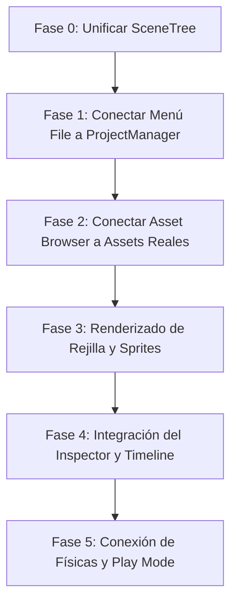

# 🛡️ VISION.md — Finalidad, Arquitectura y Mapa de Ruta del Proyecto Forge

Este documento es el **único punto de verdad** de la visión de diseño, arquitectura técnica y estado de desarrollo del ecosistema **Forge**. Su lectura es obligatoria para comprender el rumbo del proyecto y evitar código duplicado.

---

## 🎮 1. LA VISIÓN: CONSOLA VIRTUAL Y ESPÍRITU RETRO

**Forge** es un motor de videojuegos 2.5D en Rust diseñado para crear juegos de estilo clásico (isométricos, plataformas y run-and-gun) bajo las restricciones técnicas de una **consola virtual RISC-V portátil** emulada:

- **Resolución Rígida:** Pantalla virtual fija de `960x540` con renderizado mediante **Integer Scaling** sin suavizado (pixel-art estricto).
- **Límites de Hardware Clásicos:**
  - Máximo de **10,000 sprites** en memoria.
  - Tamaño de cartucho/ROM limitado a **600 MB**.
  - Control de entrada nativo y optimizado para mando (Xbox).
- **Restricción Cromática:** Pipeline de importación de texturas con validación estricta de paletas de **256 colores indexados**. Si una imagen importada excede este límite, el sistema bloquea su guardado y ofrece un remuestreo asistido por software.
- **Visual Bubbles (Gizmos 2D):** Representación visual en el editor de zonas de trigger físicas, emisores de partículas y radios de atenuación de sonido 3D posicional, facilitando la edición visual de mapas de forma relacional.

---

## 🏛️ 2. ARQUITECTURA TÉCNICA DEL WORKSPACE

El ecosistema está fragmentado en crates especializados que separan las responsabilidades lógicas del backend de la interfaz visual del editor:

```
                  +--------------------------------+
                  |  forge-editor (egui + eframe)  |
                  +--------------------------------+
                                  |
         +------------------------+------------------------+
         |                        |                        |
         v                        v                        v
+-----------------+      +-----------------+      +-----------------+
|   forge-scene   |      |  forge-physics  |      | forge-animation |
| (Hierarchy/ECS) |      |   (Collisions)  |      | (Keyframes/Plr) |
+-----------------+      +-----------------+      +-----------------+
         |                        |                        |
         +------------------------+------------------------+
                                  |
                                  v
                       +---------------------+
                       |    forge-project    |
                       |   (Project/TOML)    |
                       +---------------------+
```

### 🧱 A. `forge-scene`
- **Responsabilidad:** Árbol de nodos, jerarquía y gestión de componentes (ECS).
- **Tipos clave:**
  - `NodeData` (`scene_node.rs`): Representa una entidad en la escena con sus componentes y relaciones jerárquicas.
  - `ComponentData` (`component_data.rs`): Estructura unificada para componentes como `Transform`, `Collider`, `Renderer`, `Sprite`, `Audio`, `Script` y `Dialogue`.
  - `SceneTreeEditor` (`scene_tree.rs`): Controlador auxiliar del estado de selección, hover y reordenamiento lógico de nodos.

### 📐 B. `forge-physics`
- **Responsabilidad:** Simulación física de cuerpos 2D.
- **Tipos clave:**
  - `PhysicsWorld` (`physics_body.rs`): Mundo físico que almacena los cuerpos y resuelve colisiones AABB y circulares mediante `update()`.
  - `PhysicsBody` (`physics_body.rs`): Propiedades físicas (`Static`, `Kinematic`, `Dynamic`, masa, fricción, restitución).

### 🎬 C. `forge-animation`
- **Responsabilidad:** Interpolación y clips de animación.
- **Tipos clave:**
  - `Animation` (`animation.rs`): Estructura de keyframes, duración, fps e interpolación de transformaciones.
  - `AnimationPlayer` (`animation_player.rs`): Orquestador de la reproducción frame a frame.

### 📂 D. `forge-project`
- **Responsabilidad:** Carga, creación y persistencia de proyectos en disco.
- **Tipos clave:**
  - `Project` (`project.rs`): Configuración, límites y física inicial del proyecto según el género (`GameType`).
  - `ProjectWizard` (`project.rs`): Automatiza la creación física de la estructura de subcarpetas en disco (`assets/sprites/`, `mapas/`, `scripts/`, etc.) y escribe el `proyecto.toml`.
  - `ProjectManager` (`project.rs`): Gestor CRUD de proyectos activos en la aplicación.

---

## 🎨 3. EL EDITOR (`forge-editor`) Y ESTADO DE LA UI

El editor es la capa visual de composición. Actualmente **compila limpio con 0 errores** y presenta el siguiente estado:

- **Scene Tree Panel:** Utiliza `ui::SceneTreeUI` para renderizar el árbol de nodos de la escena en base a `self.scene`.
- **Viewport Panel:** Instanciado en `ui/viewport.rs` con variables para cámara (zoom, offset) y drop de assets lógicos.
- **Inspector Panel:** Muestra el nombre y tipo de entidad seleccionada, y cuenta con editores listos para transformaciones, componentes y scripts.
- **Timeline Panel:** Estructura en `ui/timeline.rs` para manipular keyframes de animación.

---

## 🎯 4. MAPA DE RUTA: TAREAS DE CONEXIÓN PENDIENTES

El objetivo prioritario es **conectar la UI con la lógica real de los crates de backend** eliminando dependencias ficticias:



### 🔹 Fase 0: Unificación de Tipos (Reemplazo del Stub)
Reemplazar los tipos temporales locales de `forge_scene_stub` por las referencias reales de `forge-scene` (`NodeData`, `SceneTree`, `Asset`).

### 🔹 Fase 1: Conexión del Gestor de Proyectos
Vincular el menú superior File con `app.project_manager` para permitir la creación y carga real de proyectos en el disco duro.

### 🔹 Fase 2: Navegador de Assets del Disco
Apoyar el Explorador de Archivos inferior en la ruta real del proyecto (`project.assets_path()`) y permitir el arrastre de texturas PNG al lienzo del Viewport para instanciar Sprites.

### 🔹 Fase 3: Renderizado e Interactividad del Viewport
Añadir el pintado de la rejilla (isométrica/cuadrada) y la visualización interactiva de nodos en `ui/viewport.rs` con soporte para paneo, zoom y selección con ratón.

### 🔹 Fase 4: Play Mode y Simulación Física
Activar la actualización de `app.physics` y `app.particles` en el bucle principal cuando el modo Play esté activo, y reflejar el movimiento físico de las entidades en el lienzo.

---

## 🛠️ 5. CATÁLOGO DE HERRAMIENTAS DEL EDITOR (ESTILO UNITY/GODOT/UNREAL)

Para que el editor permita crear un videojuego profesional de principio a fin, se debe programar cada herramienta conectándola de forma modular y relacional sin crear código redundante:

### 📸 A. 3D Sprite Baker (Generador de Sprites)
- **Propósito:** Generar hojas de sprites de 360 grados a partir de modelos 3D (`.gltf` o `.obj`) renderizando múltiples ángulos con offset de píxeles.
- **Cómo implementarlo en la UI:**
  - Crear una pestaña/modal "3D Baker Panel".
  - El usuario selecciona un `.gltf` desde el Explorador de Assets y pulsa "Generar Rotación".
  - El backend (reutilizando crates de renderizado) guardará los PNG resultantes en `/assets/sprites/`.
  - Registrará automáticamente el nuevo sprite en el `AssetManager` real de `forge-scene`.

### ✂️ B. Sprite & Sheet Slicer (Editor de Atlas / Tilesets)
- **Propósito:** Trocear imágenes PNG en celdas, definir tilesets, ajustar márgenes y validar la paleta de color.
- **Cómo implementarlo en la UI:**
  - Al abrir un sprite o tileset en el inspector, habilitar la vista de troceado.
  - Dibujar la cuadrícula sobre la imagen original.
  - Validar que el PNG no exceda los **256 colores**. Si los excede, activar el botón de "Forzar Conversión de Paleta de Consola" que aplica el filtro cromático de Rust.
  - Guardar la metadata del troceado (coordenadas UV, propiedades del tile como "Sólido") en un archivo `.tileset` serializado con `forge-resource`.

### 🖌️ C. TileMap Painter (Pincel del Viewport)
- **Propósito:** Seleccionar una celda del Atlas/Tilesets y "pintar" mapas isométrica u ortogonalmente directamente en el Viewport con el ratón.
- **Cómo implementarlo en la UI:**
  - Al seleccionar un nodo `TileMap` en el SceneTree y activar la herramienta "Pincel" en el Toolbar superior:
    - Capturar los clics del botón izquierdo en el Viewport.
    - Calcular la celda isométrica/cuadrada correspondiente bajo el ratón.
    - Escribir la ID del tile seleccionado en el componente de datos `TileMap` del nodo de `forge-scene`.

### 🚨 D. Inspector Físico y Dibujador de Colisiones (Gizmos de Físicas)
- **Propósito:** Añadir colisiones a las entidades y visualizarlas en tiempo real en el editor.
- **Cómo implementarlo en la UI:**
  - En el panel del Inspector, al añadir un componente `Collider` o `PhysicsBody`:
    - Permitir elegir si es `Static` (suelo/paredes) o `Dynamic` (personaje con gravedad) y configurar masa/fricción.
  - En el Viewport, dibujar contornos finos translúcidos (Rojo para colisiones AABB, Azul para colisiones circulares) sobre las entidades en base a su componente de física real, para que el desarrollador vea exactamente dónde actuará el motor físico.

### 🎭 E. CineGraph & Dialogue Editor (Visual Scripting)
- **Propósito:** Enlazar eventos de diálogos, cinemáticas in-game y lógica condicional mediante nodos y conexiones visuales.
- **Cómo implementarlo en la UI:**
  - Reutilizar y conectar el `EventNodeManager` que ya existe en `app.event_node_manager`.
  - Dibujar los cables Bézier y nodos en la pestaña de `Event Forge`.
  - Crear nodos tipo `TriggerZone` (burbujas verdes transparentes en el Viewport). Al pasar el personaje por la zona en el juego, se disparará el grafo de eventos correspondiente.
  - Guardar la secuencia serializada como JSON en la subcarpeta `/eventos/` del proyecto.

### 🔊 F. Sound Sockets & Positional Audio (Audio 3D)
- **Propósito:** Colocar altavoces virtuales en el Viewport para simular audio posicional 3D.
- **Cómo implementarlo en la UI:**
  - Permitir añadir un componente `Audio` a una entidad.
  - En el Viewport, dibujar una burbuja azul semitransparente que representa el radio de alcance/atenuación del altavoz.
  - Vincular la atenuación de volumen de forma dinámica en función de la distancia del jugador al altavoz.

### ⚡ G. Play Mode & Live Reload (Simulación en Caliente)
- **Propósito:** Probar y simular el juego de manera interactiva en la propia ventana del Viewport del editor.
- **Cómo implementarlo en la UI:**
  - **Botón Play (▶):**
    - Almacenar temporalmente un snapshot de las posiciones actuales de los nodos en memoria.
    - Activar la simulación de físicas en `app.physics` actualizándola periódicamente con el delta de tiempo en el bucle principal.
    - Capturar las pulsaciones de teclado del usuario (flechas, WASD, espacio) para mover la entidad jugador mediante fuerzas físicas.
  - **Botón Stop (⏹):**
    - Detener la simulación de físicas.
    - Restaurar las posiciones originales de los nodos desde el snapshot para que el editor vuelva a su estado de edición original sin sufrir alteraciones por la simulación.
