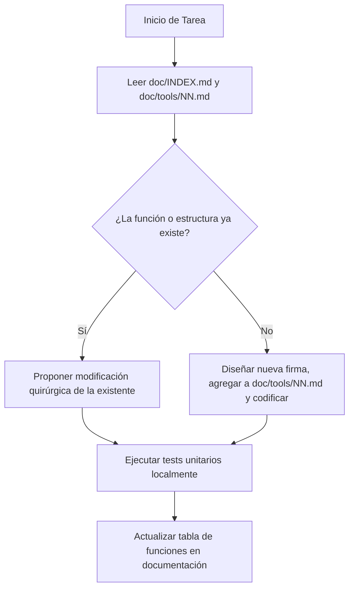

# 🤖 GUÍA DE DESARROLLO Y DIRECTRICES PARA IA (AI_GUIDELINES.md)

Este documento es el **manual de alineación y barandilla (guardrail) obligatorio** para cualquier modelo de Inteligencia Artificial (Gemini, Qwen, Claude, GPT, etc.) que trabaje en el proyecto **Forge SDK 2D**. 

Su propósito es evitar la duplicación de código, la creación redundante de documentación `.md`, la invención de APIs inexistentes y asegurar que cada función añadida quede registrada con granularidad absoluta.

---

## 🛑 1. REGLAS DE ORO (AI GUARDRAILS)

1. **NO CREAR DOCUMENTACIÓN NUEVA SIN AUTORIZACIÓN**:
   - Antes de crear un nuevo archivo `.md` en `doc/tools/`, la IA debe verificar la lista oficial en [doc/TOOLS.md](file:///c:/Users/xico0/Desktop/Xico/doc/TOOLS.md).
   - Solo se crearán archivos nuevos si el usuario lo solicita explícitamente o si se añade una herramienta con una ID libre autorizada.
   
2. **ACTUALIZACIÓN PARCIAL Y DE PRECISIÓN**:
   - Al actualizar la documentación de una herramienta en `doc/tools/`, **NUNCA** se debe sobrescribir el archivo entero si contiene notas de diseño valiosas. Usa herramientas de reemplazo de bloques de texto (`replace_file_content`) para cambiar solo la sección relevante.

3. **VERIFICACIÓN DEL ESTADO ACTUAL (CHECK FIRST)**:
   - Antes de proponer cualquier cambio o escribir código Rust, la IA debe leer:
     1. [doc/INDEX.md](file:///c:/Users/xico0/Desktop/Xico/doc/INDEX.md) (Estado general de integración).
     2. [doc/VISION.md](file:///c:/Users/xico0/Desktop/Xico/doc/VISION.md) (Restricciones retro del motor).
     3. [doc/ARCHITECTURE.md](file:///c:/Users/xico0/Desktop/Xico/doc/ARCHITECTURE.md) (Mapa de crates del Workspace).

4. **EVITAR CÓDIGO DUPLICADO Y STUBS**:
   - No implementar lógica local en `forge-editor` si esa lógica pertenece a un crate especializado (`forge-scene`, `forge-physics`, `forge-animation`).
   - Reutilizar siempre las estructuras y APIs públicas reales importadas en `forge-editor/src/lib.rs`.

5. **TOLERANCIA A REFACTORIZACIONES (RUTAS DINÁMICAS)**:
   - Las rutas de archivos escritas en los `.md` (ej. `forge-editor/src/ui/mod.rs`) son instantáneas de referencia. Si el usuario refactoriza el proyecto (mueve o renombra carpetas/crates), la IA **NO** debe asumir que un componente no existe solo porque no está en la ruta exacta descrita.
   - La IA **debe buscar recursivamente** en el workspace (usando herramientas de búsqueda o listado) para verificar si el archivo o la estructura (ej. struct `SceneTree`) fue movido de lugar, en vez de volver a crearlo de cero.
   - Si la estructura física de carpetas cambia, la IA tiene la obligación de actualizar los diagramas y mapas de directorios en [doc/ARCHITECTURE.md](file:///c:/Users/xico0/Desktop/Xico/doc/ARCHITECTURE.md) y [doc/README.md](file:///c:/Users/xico0/Desktop/Xico/doc/README.md) en su siguiente interacción de documentación.

---

## 🗃️ 2. ESTÁNDAR DE REGISTRO DE FUNCIONES (GRANULARIDAD DE CÓDIGO)

Para cumplir con el requerimiento de **documentar cada función a detalle** y evitar colisiones de nombres o re-implementaciones, cualquier IA que cree o modifique funciones debe registrarlas en la **Sección 3 (IMPLEMENTACIÓN ACTUAL)** del archivo correspondiente de la herramienta en `doc/tools/NN_NOMBRE.md`.

### Estructura de Registro Obligatoria en el `.md`:
Para cada struct, enum y módulo, se debe mantener una tabla o lista de funciones con el siguiente formato:

```markdown
### 3.5 Catálogo de Funciones Detalladas

#### Struct `MiEstructura` (Archivo: `ruta/al/archivo.rs`)
| Signatura de la Función | Parámetros | Retorno | Estado / Propósito |
|---|---|---|---|
| `pub fn new() -> Self` | Ninguno | `Self` | ✅ Funcional. Inicializa con valores por defecto. |
| `pub fn update(&mut self, dt: f32)` | `dt: f32` (delta time) | `()` | 🔄 En Progreso. Integra físicas aplicadas en frame. |
| `pub fn cleanup(&mut self)` | Ninguno | `Result<(), Error>` | ⏳ Pendiente. Libera descriptores gráficos. |
```

> [!IMPORTANT]
> Si una IA implementa una nueva función en el código Rust, **tiene la obligación inmediata** de añadirla a este catálogo en la documentación de la herramienta correspondiente.

---

## 📐 3. CÓMO INTERPRETAR LA ESTRUCTURA DE DATOS EN EL WORKSPACE

El workspace está estructurado para separar el motor en memoria (datos puros y lógica) de la interfaz de usuario (egui/eframe):

1. **Jerarquía (ECS)**:
   - Administrado únicamente por `SceneTree` y `NodeData` en el crate `forge-scene`.
   - `Transform` no es un vector local; es un array fijo `[f32; 3]` (X, Y, Z de renderizado).
   
2. **Físicas**:
   - Administrado por `Physics2D` y `PhysicsWorld` en `forge-physics`.
   - Se comunica con el editor a través de coordenadas bidireccionales en el Play Mode.

3. **Eventos de UI**:
   - Administrado por `EventBus` en `forge-panel-messaging` para comunicación asíncrona entre paneles de la IDE.

4. **Grafo de Eventos**:
   - Administrado por `EventNodeManager` en `forge-event` para el visual scripting del Event Forge.

---

## 🛠️ 4. FLUJO DE TRABAJO SUGERIDO PARA LA IA

Al recibir una orden de desarrollo o actualización, la IA debe seguir este orden de interacción:



---

**Última actualización:** 2026-07-23  
**Estado de la directiva:** Activo para todas las sesiones de IA  
