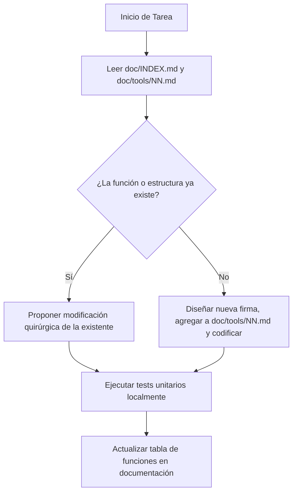

# 🤖 GUÍA DE DESARROLLO Y DIRECTRICES PARA IA (AI_GUIDELINES.md)

Este documento es el **manual de alineación y barandilla (guardrail) obligatorio** para cualquier modelo de Inteligencia Artificial (Gemini, Qwen, Claude, GPT, etc.) que trabaje en el proyecto **Forge SDK 2D**. 

Su propósito es evitar la duplicación de código, la creación redundante de documentación `.md`, la invención de APIs inexistentes y asegurar que cada función añadida quede registrada con granularidad absoluta.

---

## 🛑 1. REGLAS DE ORO (AI GUARDRAILS)

1. **NO CREAR DOCUMENTACIÓN NUEVA SIN AUTORIZACIÓN**:
   - Antes de crear un nuevo archivo `.md` en `doc/tools/`, la IA debe verificar la lista oficial en [doc/TOOLS.md](file:///c:/Users/xico0/Desktop/Xico/doc/TOOLS.md).
   - Solo se crearán archivos nuevos si el usuario lo solicita explícitamente o si se añade una herramienta con una ID libre autorizada.
   - Queda estrictamente prohibido crear archivos `.md` independientes para tests unitarios, componentes de UI secundarios o módulos auxiliares. Todo test nuevo debe documentarse en [doc/tools/TESTS.md](file:///c:/Users/xico0/Desktop/Xico/doc/tools/TESTS.md). Toda UI nueva debe documentarse en [doc/tools/Uis.md](file:///c:/Users/xico0/Desktop/Xico/doc/tools/Uis.md). Las utilidades menores deben catalogarse en la Sección 3 del documento de la herramienta principal.
   - Queda prohibido crear archivos de tareas o listas sueltos (como `todo.md` o similares) en la raíz del workspace. Todo plan de tareas o pendientes debe documentarse de forma exclusiva en [doc/PROGRESO.md](file:///c:/Users/xico0/Desktop/Xico/doc/PROGRESO.md) en la sección de próximos objetivos.
   - Los cambios de lógica en funciones del sistema, integraciones entre herramientas, sincronizaciones y flujos de consulta cruzada deben registrarse actualizando los archivos `.md` existentes de las respectivas herramientas afectadas, nunca creando nuevos documentos de integración.
   - Queda prohibido que los archivos `.md` superen de forma innecesaria las 1,500-3,000 líneas (para evitar cortar definiciones de funciones o especificaciones complejas). Si crece por encima de este límite, se debe dividir en partes lógicas (ej: `_PARTE2.md` o `_HISTORIAL.md`). Cada vez que se cree o edite un archivo `.md` de tamaño considerable, la IA debe generar o actualizar obligatoriamente una cabecera con un índice o tabla de contenidos al inicio del archivo si no cuenta con ella, facilitando lecturas parciales quirúrgicas de la IA sin consumir contexto innecesario. Si un cambio aplica a una sección preexistente, se debe modificar quirúrgicamente en la parte original, no añadiendo notas redundantes en las expansiones.
   - Cuando se autorice la creación de una nueva herramienta, se debe crear el archivo `.md` utilizando el nombre exacto de la herramienta/uso en cuestión y siguiendo fielmente la estructura de 10 secciones de la plantilla oficial.
   
2. **ACTUALIZACIÓN PARCIAL Y DE PRECISIÓN**:
   - Al actualizar la documentación de una herramienta en `doc/tools/`, **NUNCA** se debe sobrescribir el archivo entero si contiene notas de diseño valiosas. Usa herramientas de reemplazo de bloques de texto (`replace_file_content`) para cambiar solo la sección relevante.

3. **VERIFICACIÓN DEL ESTADO ACTUAL (CHECK FIRST)**:
   - Antes de proponer cualquier cambio o escribir código Rust, la IA debe leer:
     1. [doc/INDEX.md](file:///c:/Users/xico0/Desktop/Xico/doc/INDEX.md) (Estado general de integración).
     2. [doc/VISION.md](file:///c:/Users/xico0/Desktop/Xico/doc/VISION.md) (Restricciones retro del motor).
     3. [doc/ARCHITECTURE.md](file:///c:/Users/xico0/Desktop/Xico/doc/ARCHITECTURE.md) (Mapa de crates del Workspace).

4. **EVITAR CÓDIGO DUPLICADO Y STUBS**:
   - No implementar lógica local en `forge-editor` si esa lógica pertenece a un crate especializado (`forge-scene`, `forge-physics`, `forge-animation`).
   - Reutilizar siempre las estructuras y APIs públicas reales importadas en `forge-editor/src/lib.rs`.

5. **TOLERANCIA A REFACTORIZACIONES (RUTAS DINÁMICAS)**:
   - Las rutas de archivos escritas en los `.md` (ej. `forge-editor/src/ui/mod.rs`) son instantáneas de referencia. Si el usuario refactoriza el proyecto (mueve o renombra carpetas/crates), la IA **NO** debe asumir que un componente no existe solo porque no está en la ruta exacta descrita.
   - La IA **debe buscar recursivamente** en el workspace (usando herramientas de búsqueda o listado) para verificar si el archivo o la estructura (ej. struct `SceneTree`) fue movido de lugar, en vez de volver a crearlo de cero.
   - Si la estructura física de carpetas cambia, la IA tiene la obligación de actualizar los diagramas y mapas de directorios en [doc/ARCHITECTURE.md](file:///c:/Users/xico0/Desktop/Xico/doc/ARCHITECTURE.md) y [doc/README.md](file:///c:/Users/xico0/Desktop/Xico/doc/README.md) en su siguiente interacción de documentación.

6. **CONSISTENCIA Y CONSERVACIÓN DEL ESTILO DE CÓDIGO EXISTENTE**:
   - La IA debe respetar y mantener de forma prioritaria la estructura, el formato, el estilo y los patrones del código preexistente en cada archivo.
   - Queda prohibido reformatear archivos completos o reescribir lógica funcional con otros estilos (por ejemplo, cambiar flujos de control, estructuras de préstamos o control de errores) a menos que se solicite de forma explícita. El código nuevo debe integrarse y mimetizarse de manera invisible con el código de su entorno.

7. **ACTUALIZACIÓN AUTOMÁTICA DE PROGRESO (AI HANDOFF)**:
   - Al finalizar cualquier tarea, sesión o cambio en el código, la IA tiene la obligación de actualizar el archivo [doc/PROGRESO.md](file:///c:/Users/xico0/Desktop/Xico/doc/PROGRESO.md).
   - Debe registrar detalladamente las modificaciones hechas, actualizar las métricas de pruebas unitarias totales activas en verde (ej: 96 tests totales) y redefinir con precisión el estado y tareas pendientes en la sección `## 🎯 PRÓXIMOS OBJETIVOS` para que el siguiente agente retome el trabajo sin fricciones y sin necesidad de preguntar.

---

## ✅ CHECKLIST OBLIGATORIO DE FINALIZACIÓN (REGLA 8)

**⚠️ CRÍTICO:** ANTES de considerar cualquier tarea como "COMPLETADA", la IA DEBE verificar y completar TODOS los siguientes items sin excepción:

### 📋 CHECKLIST DE DOCUMENTACIÓN (OBLIGATORIO)
- [ ] **Actualización de PROGRESO.md:** He actualizado `doc/PROGRESO.md` con:
  - [ ] Detalles detallados de los cambios realizados
  - [ ] Métricas actualizadas de tests (conteo real total)
  - [ ] Redefinición clara de objetivos en sección "🎯 PRÓXIMOS OBJETIVOS"
  - [ ] Fecha y responsable de los cambios

### 📋 CHECKLIST DE CÓDIGO (OBLIGATORIO)
- [ ] **Registro de Funciones:** He registrado todas las nuevas funciones/estructuras públicas en Sección 3 del documento de herramienta correspondiente
- [ ] **Ediciones Quirúrgicas:** He usado ediciones parciales (`edit`/`replace_file_content`) en lugar de reescribir archivos completos
- [ ] **Consistencia de Estilo:** El nuevo código mantiene el estilo y patrones del código existente
- [ ] **Sin Breaking Changes:** No he alterado firmas públicas sin compatibilidad retro

### 📋 CHECKLIST DE VERIFICACIÓN (OBLIGATORIO)
- [ ] **Cargo Check:** `cargo check` pasa sin errores
- [ ] **Cargo Test:** `cargo test` pasa 100% (si aplica)
- [ ] **Anti-Stubs:** No hay `todo!()`, `unimplemented!()` o placeholders en código de producción
- [ ] **Referencias Actualizadas:** He actualizado referencias en TOOLS.md, INDEX.md si aplica

### 📋 CHECKLIST DE HANDOFF (OBLIGATORIO)
- [ ] **Métricas Reales:** Los números en documentación reflejan la realidad actual
- [ ] **Objetivos Claros:** El siguiente agente puede continuar sin preguntar
- [ ] **Estado Preciso:** Herramientas marcadas con estado correcto (✅, 🟡, ⏳)
- [ ] **Contexto Completo:** Toda la información necesaria está documentada

**⚠️ ADVERTENCIA:** NO marques una tarea como "completada" hasta que TODOS los items de este checklist estén verificados. Si algún item no aplica, explica por qué en PROGRESO.md.

---

## 🗃️ 2. ESTÁNDAR DE REGISTRO DE FUNCIONES (GRANULARIDAD DE CÓDIGO)

Para cumplir con el requerimiento de **documentar cada función a detalle** y evitar colisiones de nombres o re-implementaciones, cualquier IA que cree o modifique funciones debe registrarlas en la **Sección 3 (IMPLEMENTACIÓN ACTUAL)** del archivo correspondiente de la herramienta en `doc/tools/NN_NOMBRE.md`.

### Estructura de Registro Obligatoria en el `.md`:
Para cada struct, enum y módulo, se debe mantener una tabla o lista de funciones con el siguiente formato:

```markdown
### 3.5 Catálogo de Funciones Detalladas

#### Struct `MiEstructura` (Archivo: `ruta/al/archivo.rs`)
| Signatura de la Función | Parámetros | Retorno | Estado / Propósito |
|---|---|---|---|
| `pub fn new() -> Self` | Ninguno | `Self` | ✅ Funcional. Inicializa con valores por defecto. |
| `pub fn update(&mut self, dt: f32)` | `dt: f32` (delta time) | `()` | 🔄 En Progreso. Integra físicas aplicadas en frame. |
| `pub fn cleanup(&mut self)` | Ninguno | `Result<(), Error>` | ⏳ Pendiente. Libera descriptores gráficos. |
```

> [!IMPORTANT]
> Si una IA implementa una nueva función en el código Rust, **tiene la obligación inmediata** de añadirla a este catálogo en la documentación de la herramienta correspondiente.

---

## 📐 3. CÓMO INTERPRETAR LA ESTRUCTURA DE DATOS EN EL WORKSPACE

El workspace está estructurado para separar el motor en memoria (datos puros y lógica) de la interfaz de usuario (egui/eframe):

1. **Jerarquía (ECS)**:
   - Administrado únicamente por `SceneTree` y `NodeData` en el crate `forge-scene`.
   - `Transform` no es un vector local; es un array fijo `[f32; 3]` (X, Y, Z de renderizado).
   
2. **Físicas**:
   - Administrado por `Physics2D` y `PhysicsWorld` en `forge-physics`.
   - Se comunica con el editor a través de coordenadas bidireccionales en el Play Mode.

3. **Eventos de UI**:
   - Administrado por `EventBus` en `forge-panel-messaging` para comunicación asíncrona entre paneles de la IDE.

4. **Grafo de Eventos**:
   - Administrado por `EventNodeManager` en `forge-event` para el visual scripting del Event Forge.

---

## 🛠️ 4. FLUJO DE TRABAJO SUGERIDO PARA LA IA

Al recibir una orden de desarrollo o actualización, la IA debe seguir este orden de interacción:



---

## 📝 PATRÓN DE DOCUMENTACIÓN ORGÁNICA (5 PASOS)

### PASO 1: VERIFICAR SI EXISTE (CHECK FIRST)
Antes de cualquier acción de documentación, busca en este orden:
1. **`doc/TOOLS.md`** → ¿La herramienta está autorizada en la lista?
2. **`doc/tools/NN_NOMBRE.md`** → ¿El archivo ya existe?
3. **`doc/PROGRESO.md`** → ¿El progreso ya está documentado?

### PASO 2: DECIDIR ACCIÓN

| Situación | Acción |
|-----------|--------|
| ✅ Archivo existe | ACTUALIZAR (edición quirúrgica, nunca reescribir completo) |
| ❌ No existe y autorizada | CREAR en `doc/tools/NN_NOMBRE.md` siguiendo plantilla |
| 📊 Solo progreso de código | ACTUALIZAR `doc/PROGRESO.md` con métricas y estado |

### PASO 3: SEGUIR REGLAS OBLIGATORIAS
- **NUNCA** crear duplicados (si existe, actualizar)
- **SIEMPRE** actualizar `doc/TOOLS.md` al crear nueva herramienta
- **SIEMPRE** registrar funciones en Sección 3 del .md correspondiente
- **NUNCA** reescribir archivos completos (usar `edit`/`replace_file_content`)
- **SIEMPRE** verificar consistencia con `doc/VISION.md`

### PASO 4: ACTUALIZAR REFERENCIAS
Al crear/actualizar documentación, actualiza:
- **`doc/TOOLS.md`** → Añadir/actualizar herramienta en lista
- **`doc/INDEX.md`** → Actualizar lista en `doc/tools/`
- **`doc/PROGRESO.md`** → Actualizar métricas si aplica

### PASO 5: VERIFICAR
Antes de finalizar:
- `cargo check` → Sin errores
- `cargo test` → 100% passing
- Consistencia con VISION.md y TOOLS.md
- No hay archivos duplicados en `doc/tools/`

---

## 🗂️ NIVELES DE DOCUMENTACIÓN

| Nivel | Ubicación | Uso | Regla |
|-------|-----------|-----|-------|
| **Nivel 1** | `doc/TOOLS.md` | Autorización de herramientas | SI NO ESTÁ AQUÍ → NO CREAR |
| **Nivel 2** | `doc/tools/NN_NOMBRE.md` | Documentación técnica completa (10 secciones) | SI EXISTE → ACTUALIZAR |
| **Nivel 3** | `doc/PROGRESO.md` | Progreso de desarrollo, métricas, tests | Solo cambios de progreso |

**Flujo correcto:** Nivel 1 (autorizar) → Nivel 2 (documentar) → Nivel 3 (progreso)

---

## 📋 ESTRUCTURA DE DOCUMENTACIÓN TÉCNICA (10 SECCIONES)

Cada documento en `doc/tools/NN_NOMBRE.md` debe seguir esta estructura:

1. **🎯 ESPECIFICACIONES** - Qué hace, problemas, usuarios
2. **🏗️ ARQUITECTURA** - Diagramas, componentes, API pública
3. **💻 IMPLEMENTACIÓN** - Código clave, features, TO-DO
4. **🧪 TESTS** - Unitarios, integración, validación (100% passing)
5. **🚀 USO** - Ejemplos básicos y avanzados
6. **📊 MÉTRICAS** - KPIs de calidad (líneas, funciones, coverage)
7. **🐛 PROBLEMAS CONOCIDOS** - Bugs documentados
8. **🔮 ROADMAP** - MVP, mejoras, avanzado
9. **📝 NOTAS Y DECISIONES** - Racional técnico
10. **🔗 RELACIONES** - Dependencias entre herramientas

**Plantilla:** `old/PLANTILLA.md`

---

## 🔄 ACTUALIZACIÓN DE DOCUMENTACIÓN EXISTENTE

### Reglas de actualización:
- **NUNCA** sobrescribir archivos completos con `write`
- **SIEMPRE** usar `edit`/`replace_file_content` para cambios parciales
- **SIEMPRE** mantener secciones existentes (notas de diseño, decisiones)
- **SIEMPRE** actualizar solo lo que cambió (código, métricas, status)

### Ejemplos de actualizaciones:
```markdown
// ✅ CORRECTO - Actualizar solo sección
[Edit tool] filePath="doc/tools/NN.md" oldString="// sección existente" newString="// sección actualizada"

// ❌ INCORRECTO - Reescribir completo
[Write] filePath="doc/tools/NN.md" content="// nuevo contenido completo"
```

---

**Última actualización:** 2026-07-23  
**Estado de la directiva:** Activo para todas las sesiones de IA

---

## 📊 MÉTRICAS DE DOCUMENTACIÓN

| Métrica | Objetivo | Estado |
|---------|----------|--------|
| Herramientas documentadas | 100% | ✅ |
| Tests passing | 100% | ✅ |
| Sin duplicados | 0 archivos | ✅ |
| Actualizado TOOLS.md | Siempre | ✅ |
  
