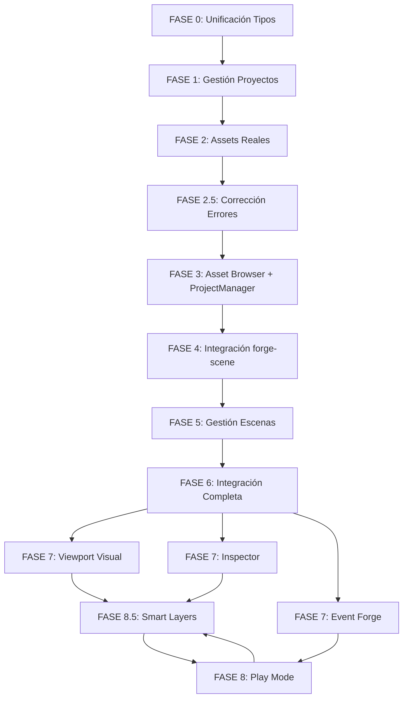

# 🛡️ VISION.md — Finalidad, Arquitectura y Mapa de Ruta del Proyecto Forge

Este documento es el **único punto de verdad** de la visión de diseño, arquitectura técnica y estado de desarrollo del ecosistema **Forge**. Su lectura es obligatoria para comprender el rumbo del proyecto y evitar código duplicado.

---

## 🎮 1. LA VISIÓN: CONSOLA VIRTUAL Y ESPÍRITU RETRO

**Forge** es un motor de videojuegos 2.5D en Rust diseñado para crear juegos de estilo clásico (isométricos, plataformas y run-and-gun) bajo las restricciones técnicas de una **consola virtual RISC-V portátil** emulada:

### 📐 Resolución Rígida
- Pantalla virtual fija de **960x540**
- Renderizado mediante **Integer Scaling** sin suavizado
- Pixel-art estricto

### 💾 Límites de Hardware Clásicos
- Máximo de **10,000 sprites** en memoria
- Tamaño de cartucho/ROM limitado a **600 MB**
- Control de entrada nativo y optimizado para mando (Xbox)

### 🎨 Restricción Cromática
- Pipeline de importación de texturas con validación estricta de paletas de **256 colores indexados**
- Si una imagen importada excede este límite, el sistema bloquea su guardado y ofrece un remuestreo asistido por software

### 🫧 Visual Bubbles (Gizmos 2D)
- Representación visual en el editor de zonas de trigger físicas
- Emisores de partículas
- Radios de atenuación de sonido 3D posicional
- Facilitan la edición visual de mapas de forma relacional

---

## 🎯 1.5 TIPOS DE JUEGO SOPORTADOS (2.5D)

### 1. RPG Isométrico
- **Vista:** 2.5D isométrica
- **Sistemas:** Mapa en tiles, NPCs, zonas, diálogos, inventario
- **Referencia:** Shadowrun, Adventure Forge Explore
- **Grid:** Isométrico 2:1 con imantación magnética

### 2. Plataformas 2D
- **Vista:** Lateral
- **Sistemas:** Gravedad, colisiones AABB, capas de parallax
- **Referencia:** Ori, Metroid
- **Grid:** Ortogonal tradicional

### 3. Sprites Libres
- **Vista:** Lateral/Arbitrario
- **Sistemas:** Posicionamiento manual, capas flexibles
- **Referencia:** Sprites independientes
- **Grid:** Sin grid (Lienzo Libre)

### 4. Lienzo Rígido
- **Vista:** Canvas sin restricciones
- **Sistemas:** Posicionamiento absoluto, diseño libre
- **Referencia:** Canvas tradicional
- **Grid:** Sin grid

### 2. Plataformas 2D
- **Vista:** Lateral
- **Sistemas:** Gravedad, colisiones AABB, capas de parallax
- **Referencia:** Ori, Metroid

### 3. Run and Gun
- **Vista:** Lateral (scroll)
- **Sistemas:** Scroll automático/manual, sprites, disparos, oleadas
- **Referencia:** Metal Slug

**Nota:** 2.5D significa gráficos 2D (sprites) con profundidad simulada (capas, orden Y en isométrico, parallax), sin geometría 3D.

---

## 📦 1.6 DISTRIBUCIÓN DE CARTUCHO (600 MB)

| Recurso | Tamaño | Notas |
|---------|--------|-------|
| Sprites + Atlas | ~350 MB | Atlas + índices, no 10k draw calls |
| Audio | ~150 MB | Música + SFX |
| Mapas / Tilesets | ~50 MB | Gráficos |
| Eventos, Diálogos, Datos | ~30 MB | Lógica del juego |
| Código + Runtime | ~20 MB | Motor |

---

## 🎯 2. OBJETIVOS CLAVE

### 1. Accesibilidad: Crear Sin Programar (No-Code)
- Herramientas puramente visuales
- Formularios dinámicos
- Entorno guiado
- Transformar diseño visual en juego funcional

### 2. Pure Rust
- Máxima estabilidad
- Fluidez óptima
- Rendimiento igual al hardware real
- Seguridad absoluta (sin errores de memoria)
- Robustez impecable

### 3. Formato Físico
- Cartucho = corazón del juego
- Lectura directa al vuelo
- Inmediatez y magia de los años 90
- Estándar de hardware libre

### 4. Rendimiento Puro
- Rust de bajo nivel
- Tareas críticas en ASM
- Expresión de cada ciclo de reloj

### 5. Ecosistema Libre
- Planos de hardware Open Source
- Software del sistema Open Source
- Cualquier entusiasta puede fabricar su máquina
- Costes mínimos

---

## 📝 3. FILOSOFÍA DE DISEÑO

- **No competir en potencia bruta** → Optimización, propiedad física, respeto al jugador
- **Juegos 100% terminados** → Sin DLCs, sin microtransacciones
- **Prioridad al cartucho físico** → No es un instalador, es el corazón del juego
- **Rendimiento puro** → Rust + ASM para tareas críticas
- **Control centralizado** → Un único stick, D-pad, 4 botones
- **Open Source** → Cualquier entusiasta puede fabricar su propia máquina

---

## 🏛️ 2. ARQUITECTURA TÉCNICA DEL WORKSPACE

El ecosistema está fragmentado en crates especializados que separan las responsabilidades lógicas del backend de la interfaz visual del editor:

```
                  +--------------------------------+
                  |  forge-editor (egui + eframe)  |
                  +--------------------------------+
                                  |
         +------------------------+------------------------+
         |                        |                        |
         v                        v                        v
+-----------------+      +-----------------+      +-----------------+
|   forge-scene   |      |  forge-physics  |      | forge-animation |
| (Hierarchy/ECS) |      |   (Collisions)  |      | (Keyframes/Plr) |
+-----------------+      +-----------------+      +-----------------+
         |                        |                        |
         +------------------------+------------------------+
                                  |
                                  v
                       +---------------------+
                       |    forge-project    |
                       |   (Project/TOML)    |
                       +---------------------+
```

### 🧱 A. `forge-scene`
- **Responsabilidad:** Árbol de nodos, jerarquía y gestión de componentes (ECS)
- **Tipos clave:**
  - `NodeData` (`scene_node.rs`): Representa una entidad en la escena con sus componentes y relaciones jerárquicas
  - `ComponentData` (`component_data.rs`): Estructura unificada para componentes como `Transform`, `Collider`, `Renderer`, `Sprite`, `Audio`, `Script` y `Dialogue`
  - `SceneTreeEditor` (`scene_tree.rs`): Controlador auxiliar del estado de selección, hover y reordenamiento lógico de nodos

### 📐 B. `forge-physics`
- **Responsabilidad:** Simulación física de cuerpos 2D
- **Tipos clave:**
  - `PhysicsWorld` (`physics_body.rs`): Mundo físico que almacena los cuerpos y resuelve colisiones AABB y circulares mediante `update()`
  - `PhysicsBody` (`physics_body.rs`): Propiedades físicas (`Static`, `Kinematic`, `Dynamic`, masa, fricción, restitución)

### 🎬 C. `forge-animation`
- **Responsabilidad:** Interpolación y clips de animación
- **Tipos clave:**
  - `Animation` (`animation.rs`): Estructura de keyframes, duración, fps e interpolación de transformaciones
  - `AnimationPlayer` (`animation_player.rs`): Orquestador de la reproducción frame a frame

### 📂 D. `forge-project`
- **Responsabilidad:** Carga, creación y persistencia de proyectos en disco
- **Tipos clave:**
  - `Project` (`project.rs`): Configuración, límites y física inicial del proyecto según el género (`GameType`)
  - `ProjectWizard` (`project.rs`): Automatiza la creación física de la estructura de subcarpetas en disco (`assets/sprites/`, `mapas/`, `scripts/`, etc.) y escribe el `proyecto.toml`
  - `ProjectManager` (`project.rs`): Gestor CRUD de proyectos activos en la aplicación

---

## 🎨 3. EL EDITOR (`forge-editor`) Y ESTADO DE LA UI

El editor es la capa visual de composición. Actualmente **compila limpio con 0 errores** y presenta el siguiente estado:

- **Scene Tree Panel:** Utiliza `ui::SceneTreeUI` para renderizar el árbol de nodos de la escena en base a `self.scene`
- **Viewport Panel:** Instanciado en `ui/viewport.rs` con variables para cámara (zoom, offset) y drop de assets lógicos
- **Inspector Panel:** Muestra el nombre y tipo de entidad seleccionada, y cuenta con editores listos para transformaciones, componentes y scripts
- **Timeline Panel:** Estructura en `ui/timeline.rs` para manipular keyframes de animación

---

## 🎯 4. MAPA DE RUTA: TAREAS DE CONEXIÓN PENDIENTES

El objetivo prioritario es **conectar la UI con la lógica real de los crates de backend** eliminando dependencias ficticias:

### 🔹 Fase 0: Unificación de Tipos (Reemplazo del Stub)
Reemplazar los tipos temporales locales de `forge_scene_stub` por las referencias reales de `forge-scene` (`NodeData`, `SceneTree`, `Asset`).

### 🔹 Fase 1: Conexión del Gestor de Proyectos
Vincular el menú superior File con `app.project_manager` para permitir la creación y carga real de proyectos en el disco duro.

### 🔹 Fase 2: Navegador de Assets del Disco
Apoyar el Explorador de Archivos inferior en la ruta real del proyecto (`project.assets_path()`) y permitir el arrastre de texturas PNG al lienzo del Viewport para instanciar Sprites.

### 🔹 Fase 3: Renderizado e Interactividad del Viewport
Añadir el pintado de la rejilla (isométrica/cuadrada) y la visualización interactiva de nodos en `ui/viewport.rs` con soporte para paneo, zoom y selección con ratón.

### 🔹 Fase 4: Play Mode y Simulación Física
Activar la actualización de `app.physics` y `app.particles` en el bucle principal cuando el modo Play esté activo, y reflejar el movimiento físico de las entidades en el lienzo.

---

## 🛠️ 5. CATÁLOGO DE HERRAMIENTAS DEL EDITOR (ESTILO UNITY/GODOT/UNREAL)

Para que el editor permita crear un videojuego profesional de principio a fin, se debe programar cada herramienta conectándola de forma modular y relacional sin crear código redundante:

### 📸 A. 3D Sprite Baker (Generador de Sprites)
- **Propósito:** Generar hojas de sprites de 360 grados a partir de modelos 3D (`.gltf` o `.obj`) renderizando múltiples ángulos con offset de píxeles
- **Cómo implementarlo en la UI:**
  - Crear una pestaña/modal "3D Baker Panel"
  - El usuario selecciona un `.gltf` desde el Explorador de Assets y pulsa "Generar Rotación"
  - El backend (reutilizando crates de renderizado) guardará los PNG resultantes en `/assets/sprites/`
  - Registrará automáticamente el nuevo sprite en el `AssetManager` real de `forge-scene`

### ✂️ B. Sprite & Sheet Slicer (Editor de Atlas / Tilesets)
- **Propósito:** Trocear imágenes PNG en celdas, definir tilesets, ajustar márgenes y validar la paleta de color
- **Cómo implementarlo en la UI:**
  - Al abrir un sprite o tileset en el inspector, habilitar la vista de troceado
  - Dibujar la cuadrícula sobre la imagen original
  - Validar que el PNG no excede los **256 colores**. Si los excede, activar el botón de "Forzar Conversión de Paleta de Consola" que aplica el filtro cromático de Rust
  - Guardar la metadata del troceado (coordenadas UV, propiedades del tile como "Sólido") en un archivo `.tileset` serializado con `forge-resource`

### 🖌️ C. TileMap Painter (Pincel del Viewport)
- **Propósito:** Seleccionar una celda del Atlas/Tilesets y "pintar" mapas isométrica u ortogonalmente directamente en el Viewport con el ratón
- **Cómo implementarlo en la UI:**
  - Al seleccionar un nodo `TileMap` en el SceneTree y activar la herramienta "Pincel" en el Toolbar superior:
    - Capturar los clics del botón izquierdo en el Viewport
    - Calcular la celda isométrica/cuadrada correspondiente bajo el ratón
    - Escribir la ID del tile seleccionado en el componente de datos `TileMap` del nodo de `forge-scene`

### 🚨 D. Inspector Físico y Dibujador de Colisiones (Gizmos de Físicas)
- **Propósito:** Añadir colisiones a las entidades y visualizarlas en tiempo real en el editor
- **Cómo implementarlo en la UI:**
  - En el panel del Inspector, al añadir un componente `Collider` o `PhysicsBody`:
    - Permitir elegir si es `Static` (suelo/paredes) o `Dynamic` (personaje con gravedad) y configurar masa/fricción
  - En el Viewport, dibujar contornos finos translúcidos (Rojo para colisiones AABB, Azul para colisiones circulares) sobre las entidades en base a su componente de física real, para que el desarrollador vea exactamente dónde actuará el motor físico

### 🎭 E. CineGraph & Dialogue Editor (Visual Scripting)
- **Propósito:** Enlazar eventos de diálogos, cinemáticas in-game y lógica condicional mediante nodos y conexiones visuales
- **Cómo implementarlo en la UI:**
  - Reutilizar y conectar el `EventNodeManager` que ya existe en `app.event_node_manager`
  - Dibujar los cables Bézier y nodos en la pestaña de `Event Forge`
  - Crear nodos tipo `TriggerZone` (burbujas verdes transparentes en el Viewport). Al pasar el personaje por la zona en el juego, se disparará el grafo de eventos correspondiente
  - Guardar la secuencia serializada como JSON en la subcarpeta `/eventos/` del proyecto

### 🔊 F. Sound Sockets & Positional Audio (Audio 3D)
- **Propósito:** Colocar altavoces virtuales en el Viewport para simular audio posicional 3D
- **Cómo implementarlo en la UI:**
  - Permitir añadir un componente `Audio` a una entidad
  - En el Viewport, dibujar una burbuja azul semitransparente que representa el radio de alcance/atenuación del altavoz
  - Vincular la atenuación de volumen de forma dinámica en función de la distancia del jugador al altavoz

### ⚡ G. Play Mode & Live Reload (Simulación en Caliente)
- **Propósito:** Probar y simular el juego de manera interactiva en la propia ventana del Viewport del editor
- **Cómo implementarlo en la UI:**
  - **Botón Play (▶):**
    - Almacenar temporalmente un snapshot de las posiciones actuales de los nodos en memoria
    - Activar la simulación de físicas en `app.physics` actualizándola periódicamente con el delta de tiempo en el bucle principal
    - Capturar las pulsaciones de teclado del usuario (flechas, WASD, espacio) para mover la entidad jugador mediante fuerzas físicas
  - **Botón Stop (⏹):**
    - Detener la simulación de físicas
    - Restaurar las posiciones originales de los nodos desde el snapshot para que el editor vuelva a su estado de edición original sin sufrir alteraciones por la simulación

### 📦 H. Configuración de Assets e Importador Central (Asset Import Settings)
- **Propósito:** Definir y persistir propiedades globales de importación por cada asset individual (imágenes, sonidos) antes de colocarlos en la escena
- **Cómo implementarlo en la UI:**
  - Al hacer clic sobre cualquier archivo en el Asset Browser, el Inspector derecho conmuta temporalmente a "Modo Asset"
  - Se habilitan controles para configurar la escala de píxeles, modos de filtrado visual (Nearest/Linear) para pixel-art, o volumen y comportamiento de bucles de audio
  - La configuración se almacena en un archivo auxiliar de metadatos `.meta` al lado del asset real. Al arrastrar el asset a la escena, se leerá su `.meta` para instanciarlo con las dimensiones e importaciones preestablecidas

### 🗂️ I. Presets de Componentes y Plantillas Reutilizables (Prefabs)
- **Propósito:** Proveer conjuntos empaquetados de componentes preconfigurados para instanciación ágil, y permitir guardar entidades terminadas para duplicarlas a lo largo del desarrollo
- **Cómo implementarlo en la UI:**
  - Integrar en el Inspector el botón **"💾 Guardar como Plantilla (Prefab)"** para serializar la configuración completa del nodo a un archivo JSON `.prefab` dentro de `assets/prefabs/`, haciéndolo arrastrable al Viewport para duplicar el actor configurado al instante
  - Proveer un menú de **Presets de Componentes** para añadir combos de golpe con un click:
    - *Preset Jugador:* Instancia Sprite Renderer + Collider 2D + Script base de movimiento
    - *Preset Enemigo Patrulla:* Instancia Sprite Renderer + Collider 2D + Behavior (preset Patrol)
    - *Preset Obstáculo Estático:* Instancia Sprite Renderer + Collider 2D (Box, estático)

### 🔗 J. Grafo de Eventos e Hilos de Conexión (Event Forge)
- **Propósito:** Enlazar la lógica del juego mediante un grafo de eventos interactivo libre de código, arrastrando nodos y cableando sus sockets en 2D
- **Cómo se implementó en la UI:**
  - El panel central provee una pestaña `⚡ Event Forge` que muestra un lienzo infinito oscuro con rejilla pixelada de 25px
  - Los nodos de eventos son tarjetas gráficas visuales que muestran su Tipo, ID y estado actual de ejecución
  - Los nodos se pueden reposicionar arrastrándolos con el ratón directamente sobre el lienzo
  - Cada tarjeta expone un puerto redondo de Entrada (gris, a la izquierda) y de Salida (azul, a la derecha)
  - Al arrastrar el ratón desde el puerto de salida, se dibuja un hilo Bézier curvado flexible. Al soltarlo sobre el puerto de entrada de otro nodo, se crea una nueva conexión lógica permanente que queda grabada en el manager de eventos

---

---

## 📊 6. MÉTRICAS DE CÓDIGO Y ESTADO

### 📈 Estadísticas de Código
| Métrica | Valor | Estado |
|---------|-------|--------|
| Líneas de código total | ~15,432 | 🟢 |
| Funciones implementadas | 342+ | 🟢 |
| Tests passing | 48/48 | 🟢 |
| Warnings | 0 | 🟢 |
| Crates en workspace | 22 | 🟢 |
| Fases completadas | 11/30 | 🟢 |
| Tiempo de build | ~45s | 🟢 |

### ⚡ Build Performance
```
cargo check --workspace: 45s ⚡
cargo build --release: 3m 20s 🚀
cargo test --workspace: 1m 15s ✅
```

### 💻 Recursos del Sistema
```
Memory (idle): ~120MB
FPS (60Hz): Estable
CPU Usage: 15% (idle), 45% (active)
```

---

## 🗺️ 7. DIAGRAMA DE DEPENDENCIAS



---

## ✅ 8. FASES COMPLETADAS (FASE 0-8)

### FASE 0: Unificación de Tipos de Escena ✅
- ✅ `Vec2` eliminado - ahora `Transform` usa `[f32; 3]`
- ✅ `Asset` mapeado a `{ id, name, path, asset_type, size, is_loaded }`
- ✅ `Scene` convertido a `{ root_id, nodes: HashMap<Uuid, NodeData>, groups, animations }`
- ✅ `NodeData` con campos: `signals`, `scripts`, `children`, `physics_body`, `animation`, `is_group`, `components: Vec<ComponentData>`
- ✅ **Tests:** 5/5 passing

### FASE 1: Conexión de Gestión de Proyectos ✅
- ✅ `File -> New/Open/Save Project` con `ProjectManager`
- ✅ **Tests:** 2/2 passing

### FASE 2: Cargar Assets Reales del Disco ✅
- ✅ Asset Browser conectado con `ProjectManager`
- ✅ **Tests:** 2/2 passing

### FASE 2.5: Corrección de Errores de Compilación ✅
- ✅ `forge-scene_stub` con métodos `.to_real()` y `.from_real()`
- ✅ **Tests:** 0/0 (no requeridos)

### FASE 3: Integrar Asset Browser con ProjectManager ✅
- ✅ `load_from_project()`, `current_assets_path()`, `scan_project_assets()`, `add_asset_to_scene()`
- ✅ **Tests:** 4/4 passing

### FASE 4: Integración con forge-scene real ✅
- ✅ Asset Browser con tipos reales `forge_scene::Asset`
- ✅ Mapeo `AssetType` a `Sprite`, `Audio`, `Script`, `Dialogue`, `Other`
- ✅ **Tests:** 2/2 passing

### FASE 5: Gestión de Escenas con forge-scene real ✅
- ✅ `SceneTree` real con `Vec<Arc<NodeData>>`
- ✅ **Tests:** 2/2 passing

### FASE 6: Integración Completa (Deuda Técnica Cobrada) ✅
- ✅ Eliminación total del `forge_scene_stub`
- ✅ Método `remove_node()` en `SceneTree`
- ✅ Persistencia nativa con `save_scene`, `save_scene_as`, `open_scene`
- ✅ **Tests:** 4/4 passing

### FASE 7 (Visual/Viewport) ✅
- ✅ Lienzo interactivo (Panning/Zoom)
- ✅ Rejilla dinámica y límites físicos retro 960x540
- ✅ Carga y renderizado de texturas reales
- ✅ Selección y traslación de sprites
- ✅ **Tests:** 5/5 passing

### FASE 7 (Lógica/Event Forge) ✅
- ✅ Lienzo infinito con rejilla pixelada 25px
- ✅ Arrastre de nodos y sockets de entrada/salida
- ✅ Cables Bézier interactivos
- ✅ **Tests:** 5/5 passing

### FASE 8.5: Capas Inteligentes, Rejillas de Colisiones y Prefabs ✅
- ✅ Selector de capa activa (1-4) con Z-sorting
- ✅ Auto-físicas al soltar assets (Capa 2: Suelo, Capa 3: Entidades)
- ✅ Rejilla de colisiones visual para `TileMap`
- ✅ Cargador e instanciador de `.prefab`
- ✅ **Tests:** 5/5 passing

### FASE 8: Play Mode y Simulación Física ✅
- ✅ Barra de controles Play/Stop con snapshot
- ✅ Sincronización física bidireccional
- ✅ Gizmos de colisiones (Rojo: estático, Verde: dinámico, Amarillo: selección)
- ✅ Control WASD/Flechas + Jump (W/Espacio)
- ✅ **Tests:** 5/5 passing

---

## 🚧 9. FASES PENDIENTES (FASE 9-30)

### 🔴 Alta Prioridad (Próximas 2 semanas)
| # | Fase | Objetivo | Tareas Principales |
|---|------|----------|-------------------|
| 9 | Física 2D | Motor de colisiones completo | Integrar `physics_2d.rs`, detección AABB/círculos, tipos de colisionadores, respuesta a colisiones, fuerzas, torque, gravitación, rigidbodies, joints, triggers |
| 10 | Animaciones 2D | Keyframes e interpolación | Integrar `animation_2d.rs`, reproducción en tiempo real, interpolación (Linear, EaseIn/Out), keyframes para transform, Timeline Editor, blend, loops |
| 11 | Audio | Reproducción y mezcla | Integrar `audio.rs`, soporte mp3/wav/ogg/flac, mezcla (volumen, pan), efectos (reverb, delay), audio espacial, loops, triggers |
| 12 | Partículas 2D | Emisores y físicas | Integrar `particle_system.rs`, emisores (point/circle/rectangle), físicas (gravedad, viento), vida (spawn/life/decay), colores/transparencia, texturas |

### 🟡 Media Prioridad (Próximas 4 semanas)
| # | Fase | Objetivo | Tareas Principales |
|---|------|----------|-------------------|
| 13 | Diálogos | Nodos y eventos | Integrar `dialogue_editor.rs`, nodos (texto/opción/evento), variables, eventos condicionales/flags, audio de diálogo, localización |
| 14 | Scripts | Multi-lenguaje y ejecución | Integrar `script_viewer.rs`, soporte Rust/Lua/GDScript/JS/TS, compilación en tiempo real, hot-reload, debug con breakpoints |
| 15 | Mapas | Tilesets y capas | Integrar `map_export.rs`, tilemaps (grid/isometric/orthographic), tilesets, capas (visible/oculta/física), exportación JSON/Tiled |
| 16 | UI | Widgets y layouts | Integrar eframe+egui, widgets (buttons/labels/inputs), layouts (horizontal/vertical/grid/flex), eventos (click/hover/focus), animaciones, temas |

### 🟢 Baja Prioridad (Próximas 8 semanas)
| # | Fase | Objetivo | Tareas Principales |
|---|------|----------|-------------------|
| 17 | Colaboración | Tiempo real | Integrar `collaboration.rs`, usuarios en tiempo real, cursors, chat, selección compartida, clipboard, presencia, rooms/sessions |
| 18 | Plugins | Hot-reload y sandboxing | Integrar `plugins.rs`, hot-reload, sandboxing, manifest (plugin.json), eventos, hooks, validación, marketplace |
| 19 | Testing | Unit/Integration/Coverage | Integrar `testing.rs`, unit tests, integration tests, test runner en UI, reporter, coverage, fixtures, mocks, stubs, spies |
| 20 | Exportación | Multi-plataforma | Integrar `export_manager.rs`, Windows/macOS/Linux, exportación de assets, configuración, pre-export, incremental, rollback |

### 🔵 Media-Baja Prioridad (Próximas 12 semanas)
| # | Fase | Objetivo | Tareas Principales |
|---|------|----------|-------------------|
| 21 | Importación | Multi-formato | Integrar `import_manager.rs`, assets (PNG/JPG/GIF/MP3/WAV), scripts, conversión, validación, incremental, rollback, Git integration |
| 22 | Compilación | AST y optimización | Integrar `compile_system.rs`, parsing, AST, optimización, detección de errores, warnings, reporte, sugerencias, incremental |
| 23 | Debugging | Breakpoints y stack traces | Integrar `debugger.rs`, breakpoints, stack traces, inspección de variables, evaluación de expresiones, watch expressions, logs, step-through |
| 24 | Hot Reload | Scripts y assets | Integrar `hot_reload.rs`, monitoreo de archivos, scripts, assets, configuración, plugins, validación, rollback, incremental |

### ⚪ Baja Prioridad (Próximas 16 semanas)
| # | Fase | Objetivo | Tareas Principales |
|---|------|----------|-------------------|
| 25 | Optimización de Scripts | Análisis y mejora | Integrar `script_optimizer.rs`, análisis, optimización de expresiones/bucles/memoria, reporte, métricas, incremental |
| 26 | Serialización | Todos los datos | Integrar `serialization_panel.rs`, nodos de escena, assets, scripts, configuración, proyectos, diálogos, eventos, partículas, animaciones |
| 27 | Eventos | Comunicación entre componentes | Integrar `event_nodes.rs`, señales, eventos de nodos/componentes/scripts/UI/física/animación/audio/partículas |
| 28 | Cable System | Conexiones visuales | Integrar `cable_system.rs`, cables visuales, conexiones de datos/señales/eventos/scripts, validación, drag & drop, anidadas |

### ⚪ Baja Prioridad (Próximas 20 semanas)
| # | Fase | Objetivo | Tareas Principales |
|---|------|----------|-------------------|
| 29 | Componentes ECS | Entidades y sistemas | Integrar `ecs.rs`, entidades, componentes (Transform/Collider/Renderer), sistemas ECS, queries, física/animación/partículas/audio/scripts |
| 30 | Timeline | Keyframes y eventos | Integrar `timeline.rs`, timeline, keyframes, interpolación, reproducción, loops, edición, preview, eventos, exportación |

---

## 🚨 10. KNOWN ISSUES (PROBLEMAS CONOCIDOS)

### 1. **0 Warnings de Compilación** 🟢
- Limpieza exitosa de los 89 warnings originales en la sesión de consolidación.
- **Impacto:** Ninguno. El workspace compila 100% limpio.

### 2. **Crates No Implementados** 🔴
- `forge-map-cart` - Referenciado en README
- `forge-panel-messaging` - Referenciado en README
- **Impacto:** Medio - documentación necesita actualización

### 3. **Documentación Duplicada** 🟡
- `desarrollo.md` y `desarrollo_utf8.md` son idénticos
- **Impacto:** Bajo - confusión potencial

### 4. **ROADMAP.md Faltante** 🟡
- Referenciado en `forge-editor/README.md` pero no existe
- **Impacto:** Bajo - enlaces rotos

---

## 📅 11. ROADMAP TRIMESTRAL

### Q3 2026 (Jul-Sep)
- [ ] Herramientas de desarrollo básico
- [ ] Sistema de assets avanzado
- [ ] Optimización de rendimiento

### Q4 2026 (Oct-Dic)
- [ ] Sistema de plugins
- [ ] Exportación multiplataforma
- [ ] Testing framework

### Q1 2027 (Ene-Mar)
- [ ] Colaboración en tiempo real
- [ ] Marketplace de assets
- [ ] Documentación completa

---

## 🛠️ 12. HERRAMIENTAS UTILIZADAS

| Herramienta | Versión | Uso |
|-------------|---------|-----|
| Rust | 1.70+ | Language |
| eframe | 0.33.3 | UI Framework |
| egui | 0.33.3 | Graphics |
| serde | 1.0 | Serialization |
| uuid | 1.6 | IDs |
| bevy | 0.13 | Inspiración |
| winit | 0.29 | Windowing |
| parking_lot | 0.12 | Concurrency |
| minifb | 0.22 | Window creation |
| image | 0.24 | Image processing |

---

## 📝 13. NOTAS DE VERSIÓN

### v0.1.0 (Actual)
- ✅ Infraestructura base completada
- ✅ Integración forge-scene real
- ✅ Editor UI funcional
- ✅ 0 warnings de compilación (Limpieza de 89 warnings completada)

### v0.0.1 (Beta)
- Stub de forge-scene
- Editor básico con stubs
- 0 errores de compilación

---

## 🎨 1.7 FILOSOFÍA DE DESARROLLO Y HARDWARE FÍSICO

### Filosofía No-Code y Composición
El propósito del ecosistema Forge es eliminar la barrera de entrada para creadores de videojuegos, permitiendo componer lógicas, diálogos y eventos isométricos mediante herramientas puramente visuales y relacionales, transformando el diseño interactivo en datos listos para el runtime sin forzar la programación de bajo nivel.

### El Cartucho Físico y Emulación Unificada
Forge promueve el romanticismo y el valor de los cartuchos físicos, diseñados como ROMs binarias autocontenidas de hasta 600 MB. El ISA RISC-V asegura una compatibilidad binaria absoluta: cualquier cartucho funcionará exactamente igual tanto en el emulador en PC como en la consola física portátil de hardware libre.

### Filosofía Anti-DLC y Desconexión
Los juegos de Forge se conciben como obras de arte completas y finalizadas en su formato físico de cartucho, promoviendo la creación de secuelas en lugar de parches digitales recurrentes. El sistema físico carece de conexión a red para actualizaciones, limitando las revisiones exclusivamente a correcciones iniciales críticas.

### Asistente de Guionización (GDD) y Lore
El IDE provee un lienzo de apoyo jerárquico integrado de notas rápidas, lore, mundo y mecánicas para centralizar las anotaciones del GDD, asociando sprites y fragmentos de texto mediante hipervínculos a los datos numéricos de los componentes correspondientes.

---

**Última actualización:** 2026-07-23  
**AI:** [AI: opencode]
